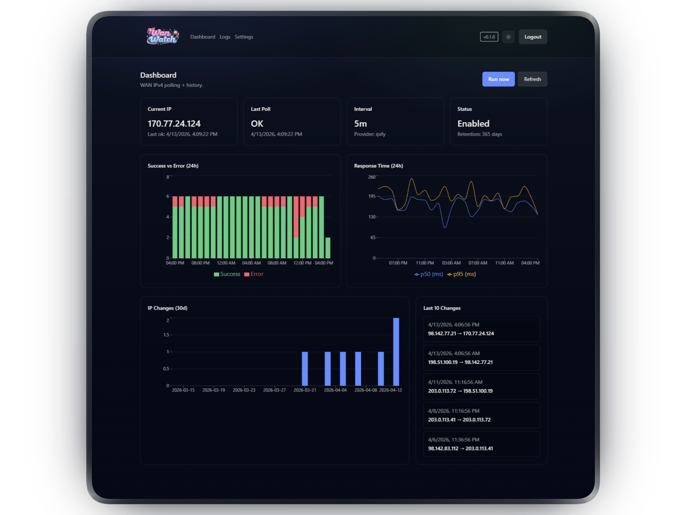

<p align="center">
  
</p>

# WanWatch

<p align="center">
  
</p>

WanWatch is a self-hosted WAN IPv4 monitor with:

- Live dashboard charts (latency, success/error, IP changes)
- Log explorer with filters and pagination
- CSV/JSON exports
- Configurable polling provider + timeout
- Optional webhook on IP change
- Optional Bearer token auth for API access
- Prometheus-style metrics endpoint

## Requirements

- Docker + Docker Compose (recommended), or
- Node.js 20+ with `pnpm`

## Quick Start (Docker)

1. Copy env file:
```bash
cp .env.example .env
```
2. Edit `.env` and set at minimum:
- `ADMIN_PASSWORD`
- `COOKIE_SECRET` (long random string, at least 32 chars)
3. Start services:
```bash
docker compose up --build
```
4. Open:
- `http://localhost:3000`

Data is persisted under `./data` (default DB path: `/app/data/wanwatch.db` in containers).

## Local Development

1. Install dependencies:
```bash
corepack enable
pnpm install
```
2. Apply migrations:
```bash
pnpm prisma:deploy
```
3. Run app and worker in separate terminals:
```bash
pnpm dev
pnpm worker:dev
```

## Configuration

Environment variables are defined in [`.env.example`](./.env.example):

| Variable | Required | Description |
| --- | --- | --- |
| `ADMIN_PASSWORD` | Yes | Password for web login |
| `COOKIE_SECRET` | Yes | Session secret (min 32 chars) |
| `DATABASE_URL` | No | Prisma DB URL (default `file:/app/data/wanwatch.db`) |
| `TZ` | No | Timezone for runtime environment |
| `API_KEY` | No | Enables Bearer token API access when set |

## API and Auth

API routes accept either:

- Logged-in web session cookie, or
- `Authorization: Bearer <API_KEY>` (only if `API_KEY` is set)

Useful endpoints:

- `GET /api/health` (public)
- `GET /api/metrics` (public, Prometheus text format)
- `GET /api/stats`
- `GET /api/logs?limit=100&cursor=<id>&from=<date>&to=<date>&ok=true|false`
- `GET /api/export.csv`
- `GET /api/export.json`
- `GET /api/settings`
- `PUT /api/settings`
- `POST /api/poll/request` (queue immediate poll)

Example with API key:

```bash
curl -H "Authorization: Bearer $API_KEY" http://localhost:3000/api/stats
```

## Metrics

`GET /api/metrics` exposes:

- `wanwatch_polls_total{result="ok|error"}`
- `wanwatch_ip_changes_total`
- `wanwatch_last_poll_age_seconds`
- `wanwatch_worker_alive`
- `wanwatch_response_ms{quantile="0.5|0.95"}`

## Runtime Notes

- Polling runs in `worker/index.ts` and writes to SQLite via Prisma.
- Manual poll requests are queued via `POST /api/poll/request`.
- Retention cleanup is automatic based on settings.
- Webhooks fire only on IP change and are guarded against private/internal targets.

## Troubleshooting

- If login succeeds but you are redirected back to `/login` on HTTP deployments, set `COOKIE_SECURE=false` in your env file.
- If dashboard shows no data, verify worker logs and hit:
  - `http://localhost:3000/api/logs?limit=5&debug=1` (non-production only)
  - This confirms which DB file the web process is reading.
